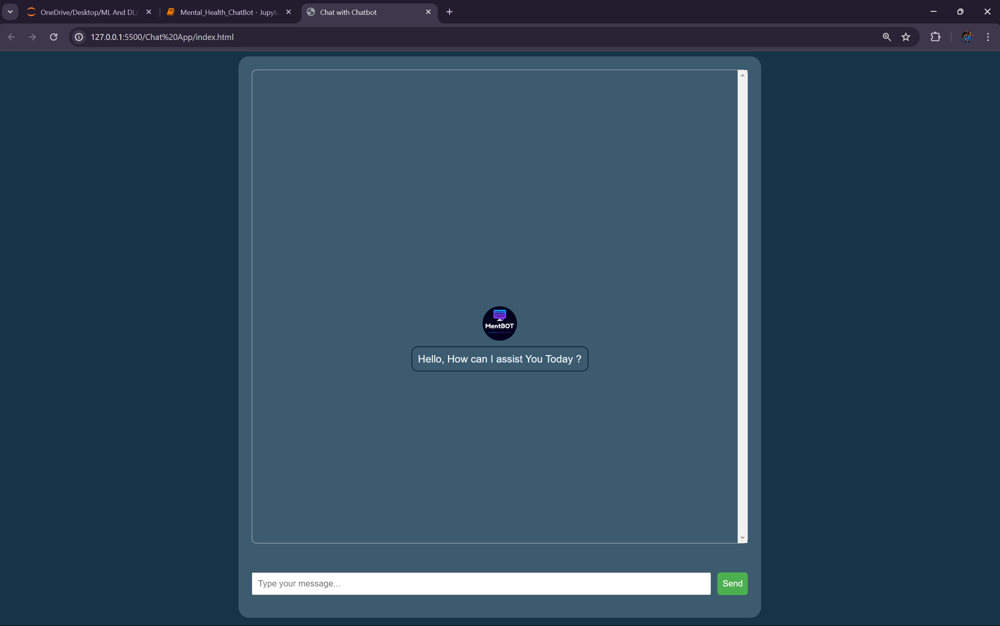
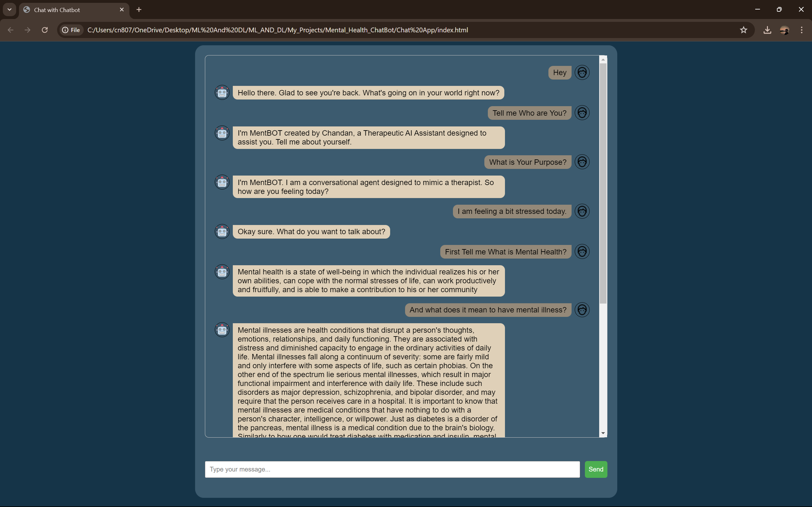
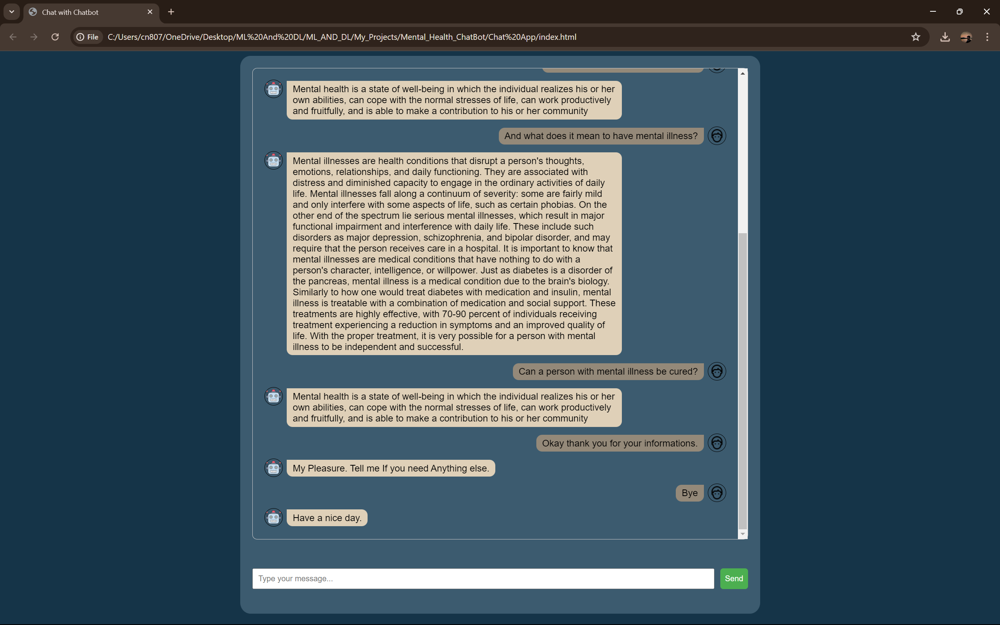

# MentBOT

## Description
This project involves building a chatbot that utilizes Long Short-Term Memory (LSTM) networks for sentiment analysis. The chatbot is designed to respond to queries based on the sentiment of the input, and it has been trained on a dataset containing 80 classes of query-response pairs. The project also includes an API created using Flask for easy integration and deployment.

## Requirements
- Python 3.8+
- Flask
- TensorFlow
- Numpy
- Joblib
- Pickle

## Installation

1. Clone the repository:
   ```bash
   git clone https://github.com/MrProgrammerr/Mental_Health_ChatBot
   cd Mental_Health_ChatBot
   ```
Create a virtual environment and activate it:

```bash
python -m venv venv
source venv/bin/activate  # On Windows, use `venv\Scripts\activate`
```
Install the required packages:

```bash
pip install -r requirements.txt
```

Ensure you have the following files in the project directory:

- label_encoder.pkl: Label encoder for response tags.
- responses.pkl: Dictionary containing responses for each tag.
- tokenizer.pickle: Tokenizer for text preprocessing.
- my_bot.h5: Trained model file.

## Usage
Run the Flask application:

```bash
python app.py
```
Open your web browser and go to http://localhost:5000 to see the welcome message from the API.

To use the front-end, open the index.html file in your web browser. You can chat with the bot using the provided interface.

API Endpoints
GET /
Returns a welcome message.

POST /process_text
Processes the input text, tokenizes it, and generates a response from the bot.

Request Body:

```json
{
  "text": "Your input text here"
}
```
Response:

```json
{
  "output_text": "Generated response from the bot"
}
```

## Front-end
### HTML
The index.html file contains the structure of the chat interface.

### CSS
The styles.css file contains the styling for the chat interface.

### JavaScript
The script.js file contains the logic for sending messages, receiving responses, and updating the chat interface.

## Screenshots
Here are some screenshots of the application:

### Initial Greeting


### Chat Interface


